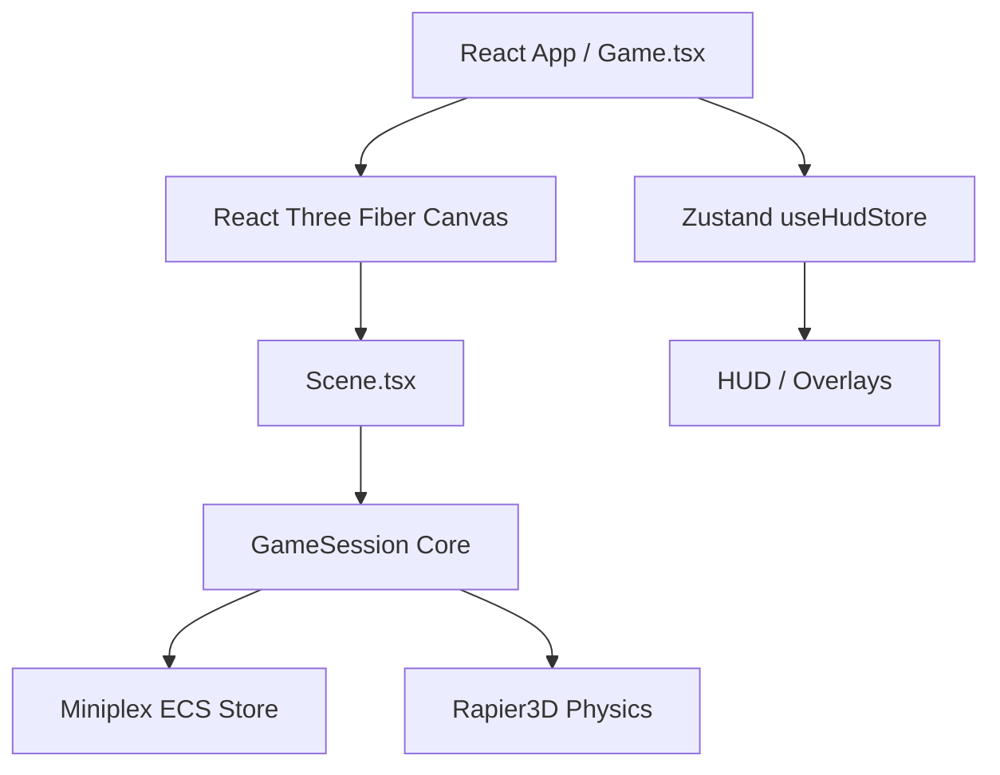
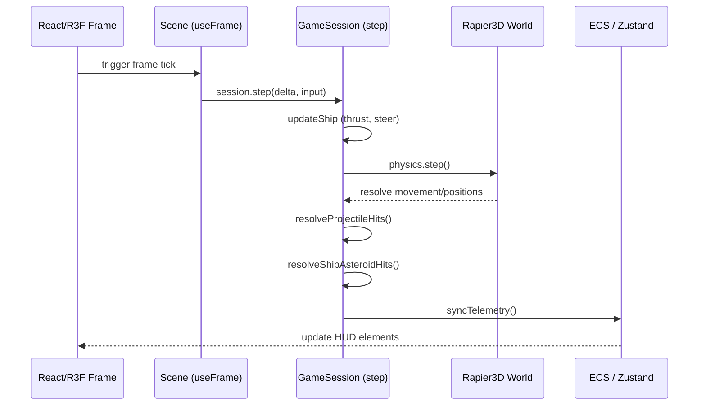

# High-Level Architecture Specification

This document provides a high-level overview of the architectural design, subsystems, and data flows of the **Asteroid Canvas React** flight simulator game.

## System Overview

The application is built using a hybrid architecture that combines a declarative frontend layer (React, React Three Fiber) with an imperative, high-performance simulation core (Miniplex ECS, Rapier3D physics). State is split between the high-frequency simulation loop and a low-frequency UI telemetry store (Zustand).

---

## Subsystems

### 1. Game State Machine & UI Layer
- **Component**: `Game.tsx`, `Hud.tsx`, `StartMenu.tsx`, `GameOver.tsx`
- **Purpose**: Governs the application-level state (`'menu' | 'playing' | 'gameover'`). Renders overlays, controls, HUD bars, and manages local storage persistence for player high scores.
- **State Store**: [useHudStore.ts](file:///Users/openclaw/Github/asteroid-canvas-react/src/game/ui/useHudStore.ts) using Zustand. Tracks current game state, telemetry summaries, auto-turret settings, and cleared asteroid counters.

### 2. Simulation Session Core
- **Component**: `createGameSession.ts`
- **Purpose**: Orchestrates all non-UI systems. Owns the instantiation and lifecycle of both the ECS entity database and the physics simulation world.
- **Lifecycle**: Re-instantiated once on boot. Mutated on tick via `step(dt, input)`. Disposed when the React component unmounts.

### 3. Entity Component System (ECS)
- **Component**: `createEntityStore.ts`, `types.ts`
- **Purpose**: Manages entities (ship, projectiles, asteroids) and their attributes. Built on top of **Miniplex**.
- **Entities**: Managed as plain JavaScript objects with optional components:
  - `ship`: Configuration and runtime state (hull, armor, shield, cooldowns).
  - `asteroid`: Hitpoints, mass, size.
  - `projectile`: Damage, time-to-live (ttl), owner type.
  - `body`: Rapier Rigidbody handle.
  - `radius`: Bounding radius for collision checks.

### 4. 3D Physics Simulation
- **Component**: `rapier.ts`, `spatial.ts`
- **Purpose**: Simulates rigid body dynamics, handles movements, forces, impulses, and velocities. Built on top of `@dimforge/rapier3d-compat`.
- **Integrations**: Syncs spatial coordinates between Rapier rigid bodies and Three.js meshes.

### 5. Gameplay Systems
Gameplay logic is partitioned into dedicated modular system factories:
- **Ship Systems (`createShipSystems.ts`)**: Reads player input to apply thrust, strafe, and yaw impulses to the ship's physics body. Controls weapon cooldowns and shields.
- **Combat Systems (`createCombatSystems.ts`)**: Resolves swept-sphere projectile hits on asteroids and ship-to-asteroid impact damage.
- **Projectile Systems (`createProjectileSystems.ts`)**: Manages projectile lifecycles and expiration limits.
- **Asteroid Field Systems (`createAsteroidField.ts`)**: Dynamically spawns asteroids in front of/around the ship, and despawns distant ones to maintain a clean simulation area.

### 6. Rendering Layer
- **Component**: `Scene.tsx`, `ShipMesh.tsx`, `AsteroidMesh.tsx`, `ProjectileMesh.tsx`, `ChaseCamera.tsx`
- **Purpose**: Renders the 3D meshes using **React Three Fiber** and standard Three.js materials. 
- **Camera**: A dampening orbit control camera that tracks the ship's position. Rotates automatically during non-playing states.

---

## Data & Update Loops

1. **Input Collection**: Keyboard events are captured via a global window listener hook `useGameInput.ts` into a mutable ref.
2. **Simulation Tick**: The `useFrame` hook in `Scene.tsx` steps the simulation session by calling `session.step(delta, input)`.
3. **Physics Step**: Rapier updates velocities, handles collisions, and solves body translations.
4. **Collision & Damage Resolution**: Combat systems iterate over active entities, checking bounding volumes, adjusting hitpoints, and triggering state changes if the ship's hull drops to 0.
5. **Telemetry Sync**: Telemetry properties are read from the physical ship entity and piped to the Zustand HUD store at the end of each tick.
6. **Mesh Synchronization**: R3F component meshes query active ECS entities and position themselves according to the Rapier rigid body translations.
